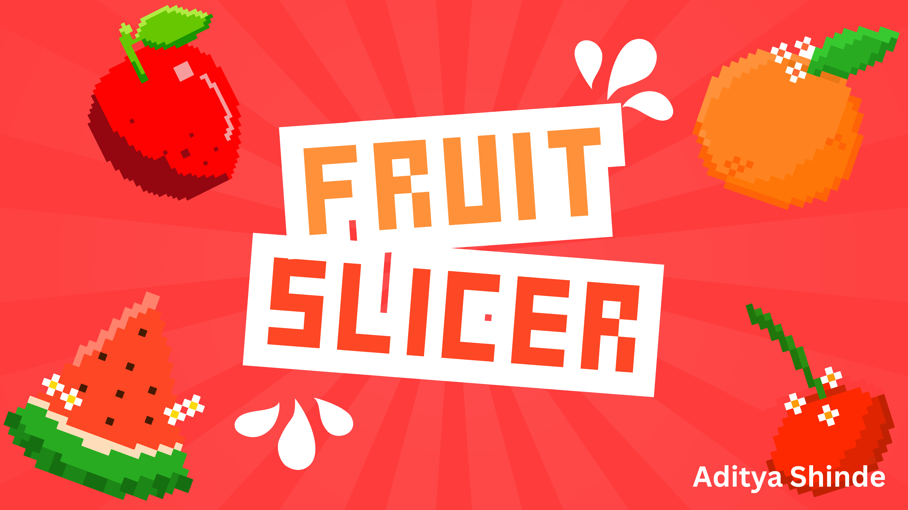
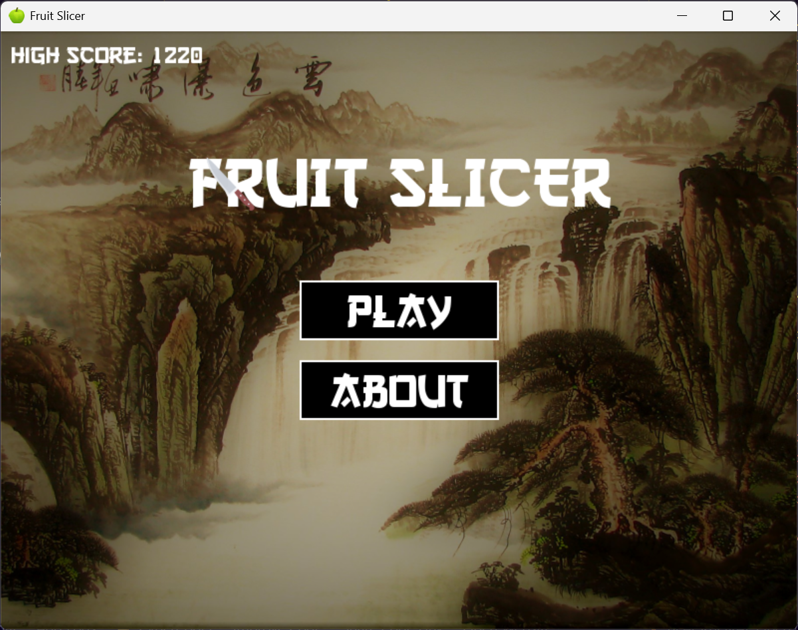
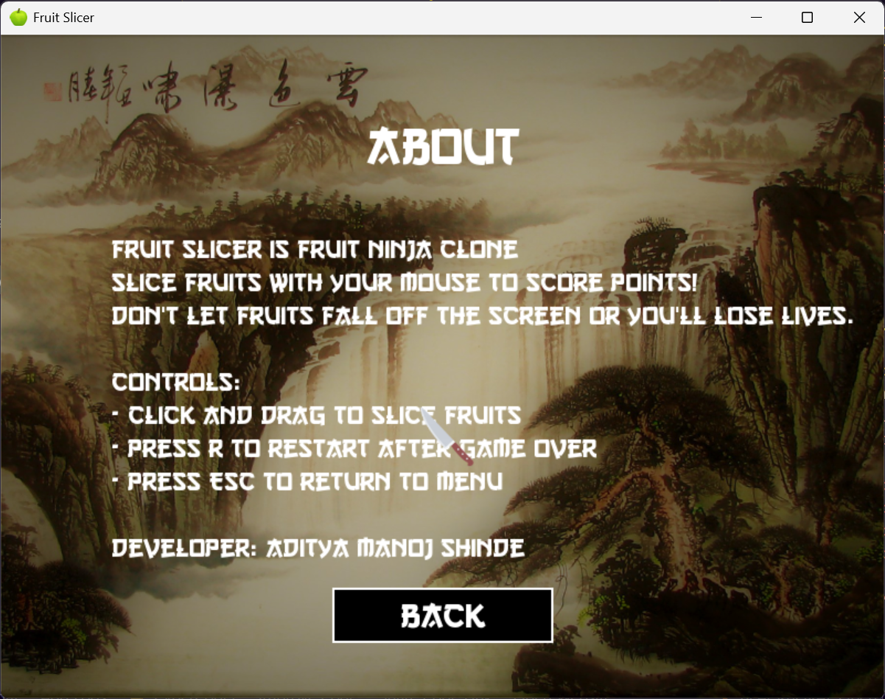
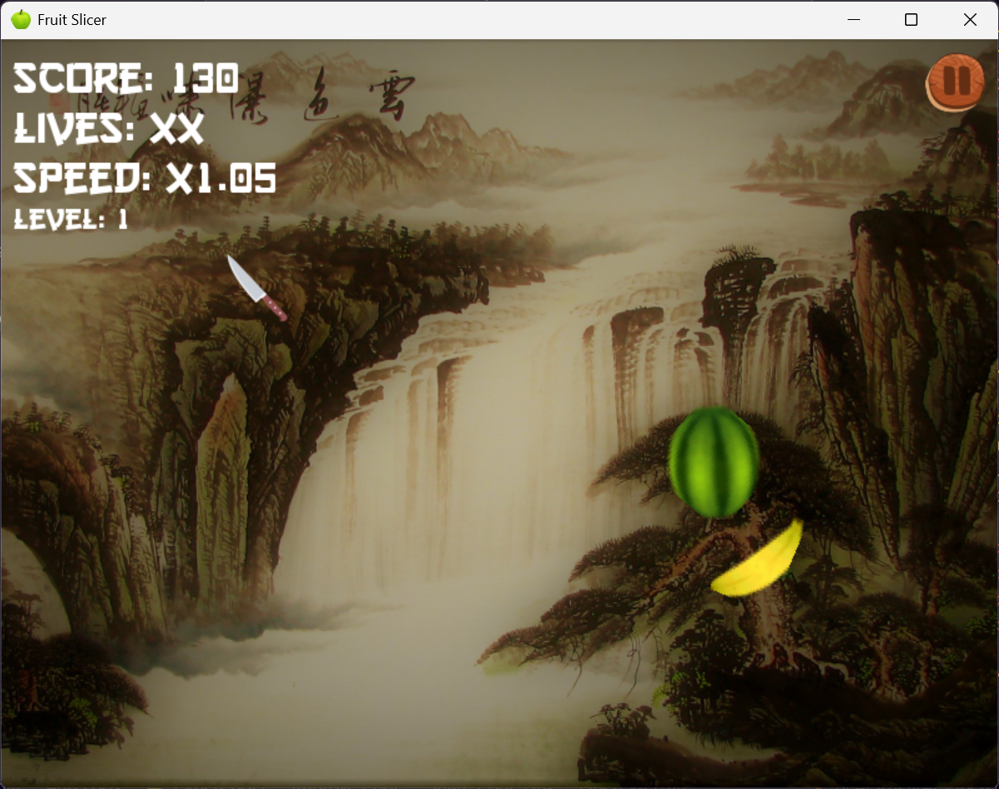
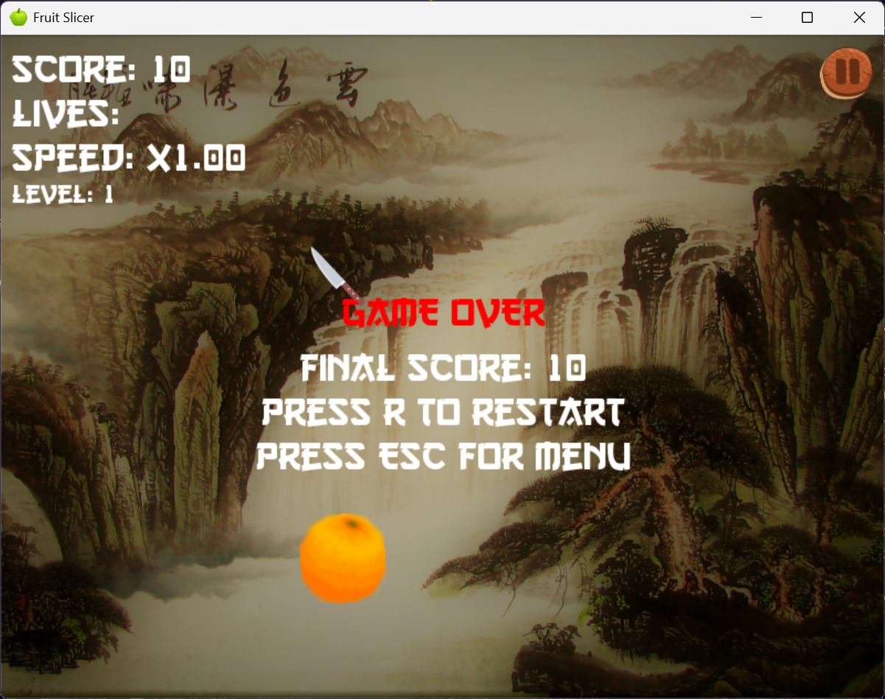

# Fruit Slicer Game


A Python implementation of the classic Fruit Ninja game built with Pygame and Amazon Q CLI.

## Screenshots


_Main menu screen with play and about options_


_Slicing fruits with the custom sword cursor_


_Special effects when slicing fruits_


_Game over screen with high score_

## Overview

This is a Python implementation of a Fruit Ninja-style game built using the Pygame library. The game allows players to slice fruits that appear on screen while avoiding bombs. The game features multiple backgrounds, progressive difficulty, and a high score system.

## Project Structure

```
/FruitSlicer/
├── fruit_ninja/
│   ├── assets/
│   │   ├── cursor/
│   │   ├── Fruits/
│   │   ├── res/
│   │   ├── sliced_fruits/
│   │   └── sounds/
│   ├── __init__.py
│   ├── constants.py
│   ├── fruit.py
│   ├── game.py
│   ├── high_scores.py
│   ├── input_handler.py
│   ├── interfaces.py
│   ├── main.py
│   ├── managers.py
│   ├── renderer.py
│   ├── screens.py
│   ├── sound_manager.py
│   ├── sprite_manager.py
│   └── utils.py
├── screenshots/
├── venv/
├── fruit_ninja_scores.json
├── requirements.txt
└── run_fruit_ninja.py
```

## Core Components

### 1. Game Class (`game.py`)

The main orchestrator that manages all game components and the game loop.

**Key Responsibilities:**

- Initialize Pygame and create the game window
- Load and manage assets (images, sounds)
- Handle window resizing
- Manage game states (home screen, gameplay, about screen)
- Process user input
- Update game objects
- Render the game
- Manage the main game loop

**Key Methods:**

- `__init__()`: Initializes the game and all its components
- `run()`: Main game loop
- `update_game()`: Updates game state for each frame
- `render_game()`: Renders the current game state
- `handle_events()`: Processes user input and events
- `reset()`: Resets the game to initial state
- `spawn_fruits()`: Creates new fruits based on current difficulty

### 2. Constants (`constants.py`)

Contains all game constants and configuration values.

**Key Elements:**

- Screen dimensions and FPS
- Color definitions
- File paths for assets (images, sounds)
- UI element paths
- Game parameters

### 3. Fruit System (`fruit.py`)

Manages the creation and behavior of fruits in the game.

**Key Classes:**

- `Fruit`: Base class for all fruit objects
- `FruitFactory`: Creates different types of fruits
- `SpecialFruit`: Fruits with special effects
- `Bomb`: Hazards that end the game when sliced

### 4. Game Managers (`managers.py`)

Contains various manager classes that handle specific game aspects.

**Key Classes:**

- `ScoreManager`: Tracks and updates player score
- `LivesManager`: Manages player lives
- `DifficultyManager`: Controls game difficulty progression
- `GameState`: Tracks the current state of the game
- `FruitSpawner`: Controls the timing and quantity of fruit spawns

### 5. Input Handling (`input_handler.py`)

Processes user input for slicing fruits and UI interactions.

**Key Methods:**

- `handle_event()`: Processes pygame events
- `is_slicing()`: Checks if the player is currently slicing
- `get_slice_points()`: Returns the points that make up the current slice

### 6. Rendering (`renderer.py`)

Handles drawing game elements to the screen.

**Key Classes:**

- `UIRenderer`: Renders UI elements like score, lives, and game state

### 7. Screens (`screens.py`)

Manages different game screens.

**Key Classes:**

- `HomeScreen`: Main menu screen
- `AboutScreen`: Information screen
- `HighScoreScreen`: Displays high scores

### 8. Sound Management (`sound_manager.py`)

Handles all game audio.

**Key Methods:**

- `play_sound()`: Plays a sound effect
- `play_music()`: Plays background music
- `pause_music()`: Pauses the current music
- `unpause_music()`: Resumes paused music

### 9. Sprite Management (`sprite_manager.py`)

Loads and manages game sprites.

**Key Methods:**

- `load_fruit_sprites()`: Loads fruit images
- `get_fruit_sprite()`: Returns the sprite for a specific fruit
- `get_sliced_fruit_sprites()`: Returns the sliced version of a fruit sprite

### 10. High Score System (`high_scores.py`)

Manages the persistent high score system.

**Key Methods:**

- `add_score()`: Adds a new high score
- `get_high_scores()`: Returns the list of high scores
- `is_high_score()`: Checks if a score qualifies as a high score

## Game Features

### 1. Gameplay

- Slice fruits by dragging the mouse across the screen
- Avoid bombs or lose the game
- Score points for each sliced fruit
- Lose lives when fruits fall off-screen unsliced

### 2. Progressive Difficulty

- Speed increases as the player scores more points
- More fruits spawn as the game progresses
- Background changes based on score thresholds

### 3. Special Items

- Regular fruits (banana, apple, orange, watermelon)
- Magic beans (special effect)
- Freeze bananas (special effect)
- Bombs (game over when sliced)
- Minus 10 bombs (reduce score when sliced)

### 4. Visual Elements

- Custom sword cursor
- Multiple background scenes
- Animated fruit slicing
- Visual effects for slices

### 5. Audio

- Background music
- Sound effects for slicing, throwing fruits, button clicks, etc.
- Special sounds for game events (game over, high score, etc.)

### 6. UI Features

- Home screen with play and about options
- In-game UI showing score, lives, and level
- Pause/resume functionality
- Game over screen with restart option
- High score display

## How to Run the Game

1. Ensure Python and required dependencies are installed:

   ```
   pip install -r requirements.txt
   ```

2. Run the game:
   ```
   python run_fruit_ninja.py
   ```

## Game Controls

- **Mouse Movement**: Move the sword cursor
- **Mouse Drag**: Slice fruits
- **Click Pause Button**: Pause/resume the game
- **UI Buttons**: Navigate menus and restart game

## Development Notes

- The game uses an object-oriented architecture for maintainability
- Pygame is used for rendering, input handling, and sound
- The game supports window resizing while maintaining aspect ratio
- High scores are saved to a JSON file for persistence
- Developed with assistance from Amazon Q CLI for code structure and game mechanics

## Future Enhancements

- Additional fruit types
- More special effects
- Multiplayer mode
- Additional game modes (time attack, zen mode)
- Mobile touch support
- Customizable difficulty settings
